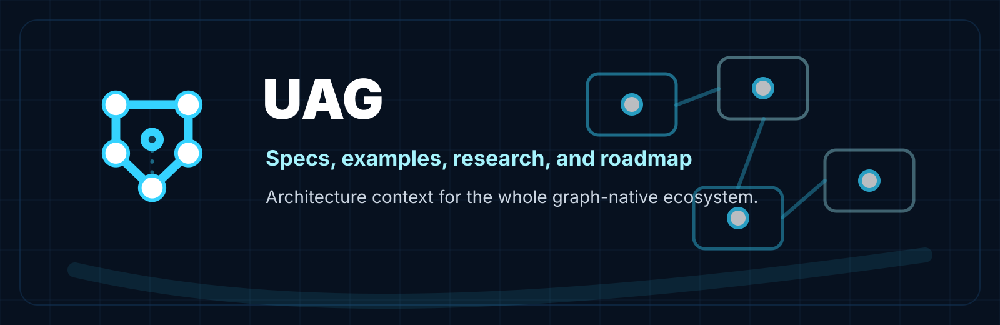

<p align="center">
  
</p>

# UAG

Universal Architecture Graph: specs, docs, examples, research, and roadmap for a graph-native architecture compiler platform.

## Mission
UAG-Labs is building a system where software architecture becomes source code. The architecture graph is the program — not a picture of it. It describes software as nodes, edges, events, capabilities, resources, constraints, and goals. The compiler validates, transforms, and compiles that graph into real implementation targets.

## Core Principle
```text
The architecture graph is the source of truth.
The diagram is a view.
The export is a projection.
The code is a compilation target.
```

## What This Repo Is
`UAG` is the root documentation and specification repository for the UAG-Labs organization.

It owns:
- organization-level purpose,
- TAKG and UAGL specs,
- examples,
- research summaries,
- roadmap,
- cross-repo context.

It does not own:
- Rust core implementation,
- compiler implementation,
- CLI implementation,
- Studio UI implementation.

## Four Repositories
- `UAG` — specs, docs, examples, research, and roadmap.
- `UAG-core` — shared Rust graph model, schemas, ontology, dialects, and validation primitives.
- `UAG-compiler` — Rust compiler and CLI: validates TAKG, lowers to UAGL, compiles to code and other output targets.
- `UAG-studio` — React visual editor — the human trust and inspection layer for the architecture graph.

## Graph Primitives
UAG architecture graphs are built from typed primitives:

| Primitive | Description |
|---|---|
| **Nodes** | Systems, services, modules, components, agents, processes |
| **Edges** | Calls, dependencies, data flows, event subscriptions |
| **Events** | Domain events, commands, queries, notifications |
| **Capabilities** | Operations a node exposes or consumes |
| **Resources** | Databases, queues, stores, streams, cloud primitives |
| **Constraints** | Security boundaries, SLAs, data retention, access rules |
| **Goals** | Business objectives, quality attributes, non-functional requirements |

## TAKG
Typed Architecture Knowledge Graph. The editable source graph used by humans and AI. The input to the compiler.

## UAGL
Universal Architecture Graph Language. The normalized compiled architecture IR emitted by the compiler. The input to all output targets.

## Compilation Targets
The compiler emits from UAGL into real implementation targets:

```text
Rust · TypeScript · React · C
diagrams (Mermaid, D2) · docs (Markdown) · API contracts (OpenAPI, AsyncAPI)
deployment stubs · AI context
```

Diagrams and docs are projections. Code is a compilation target. Both flow from the same graph.

## End-to-End Workflow
```text
Human or AI edits TAKG (in Studio or directly)
→ Compiler validates and resolves
→ Compiler lowers to UAGL
→ Compiler emits code, diagrams, docs, contracts, deployment stubs, and AI context
```

## Studio: the trust layer
The visual editor is not just a drawing surface. It is the interface through which humans inspect and approve the architecture graph. AI can modify the graph, but Studio is the required trust layer — you need to see what you are compiling before you compile it.

## Current State
Brand-new documentation initialization. This repo should be committed before implementation begins in sibling repos.
